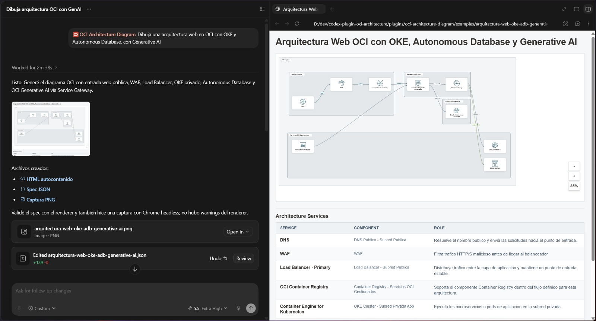

# OCI Architecture Diagram for Codex

Codex marketplace repository for installing the `oci-architecture-diagram`
plugin. The plugin helps Codex normalize Oracle Cloud Infrastructure
architecture prompts, validate the diagram model, render portable HTML/SVG
diagrams, and open the local gallery in the Codex Browser.



## Install From GitHub

Users can add the marketplace with any of these forms:

```powershell
codex plugin marketplace add jgangini/codex-plugin-oci-architecture-diagram
codex plugin marketplace add jgangini/codex-plugin-oci-architecture-diagram@v0.4.0
codex plugin marketplace add https://github.com/jgangini/codex-plugin-oci-architecture-diagram.git
```

For local testing before publishing:

```powershell
git clone https://github.com/jgangini/codex-plugin-oci-architecture-diagram.git
cd codex-plugin-oci-architecture-diagram
codex plugin marketplace add .
```

Then open Codex, find **OCI Architecture Diagram** in the plugin list, install
it if needed, and start a new thread so the plugin skills are loaded.

## Upgrade

```powershell
codex plugin marketplace upgrade oci-architecture
```

Pinned installs can be upgraded by changing the Git ref, for example from a
tag to `main` or from `v0.4.0` to a newer release tag.

## Marketplace Layout

The marketplace entry lives at:

```text
.agents/plugins/marketplace.json
```

It exposes one plugin:

```text
plugins/oci-architecture-diagram
```

The marketplace source path is intentionally relative:

```json
"path": "./plugins/oci-architecture-diagram"
```

That keeps installation flexible across GitHub shorthand, HTTPS Git URLs, SSH
Git URLs, pinned refs, and local clone workflows.

## Development

From `plugins/oci-architecture-diagram`:

```powershell
python scripts/generate_oci_diagram.py --spec examples/web-architecture.json --out examples/web-architecture.html
python scripts/serve_architecture_site.py --port 8765 --diagram web-architecture
```

Then open:

```text
http://127.0.0.1:8765/src/index.html?diagram=web-architecture
```

Run tests from the repository root:

```powershell
python -m unittest discover -s plugins/oci-architecture-diagram/tests -v
```

Some icon extraction tests expect Oracle OCI stencil sources under a sibling
`oci/` directory. Renderer and packaging tests do not require those external
source files.

## Skills

- `oci-architecture-diagram`: orchestrate the full diagram workflow from prompt
  normalization through validation, rendering, and visual QA.
- `oci-spec-normalizer`: convert Spanish or English architecture prompts into
  normalized OCI diagram JSON specs.
- `oci-architecture-validator`: validate diagram specs for schema correctness,
  coherent service placement, missing connections, duplicated ids, and
  render-risk.
- `oci-diagram-renderer`: render validated specs into portable static HTML/SVG
  diagrams and report renderer warnings and output paths.
- `oci-diagram-visual-qa`: visually verify generated diagrams for icon
  rendering, text overlap, edge labels, arrow readability, spacing, zoom, and
  gallery navigation.
- `oci-icon-catalog`: maintain the OCI icon catalog, aliases, SVG sanitization,
  and service icon mappings.
- `oci-architecture-case-deck`: coordinates discovery, cost-aligned OCI
  architecture, Oracle Cost Estimator JSON and portable 16:9 Case/Architecture/BoM decks.

## Release 0.4.0

Version 0.4.0 adds a cost-aligned Case/Architecture/BoM deck, a portable JSON
project portfolio with editing, duplication, selective ZIP export, and
presentation-ready 16:9 capture support. Generated decks now use the same
component inventory in the architecture, service descriptions and BoM.

## Notes

The internal plugin name remains `oci-architecture-diagram` for compatibility
with the existing Codex plugin package. The marketplace name is
`oci-architecture`.

## License

This project is licensed under the MIT License.

OCI Architecture Diagram is an independent project and is not an official
Oracle product. It is not affiliated with, endorsed by, or sponsored by Oracle
Corporation. Oracle, OCI, and related marks are trademarks or registered
trademarks of Oracle and/or its affiliates. Third-party trademarks, logos,
service names, and assets remain the property of their respective owners.
